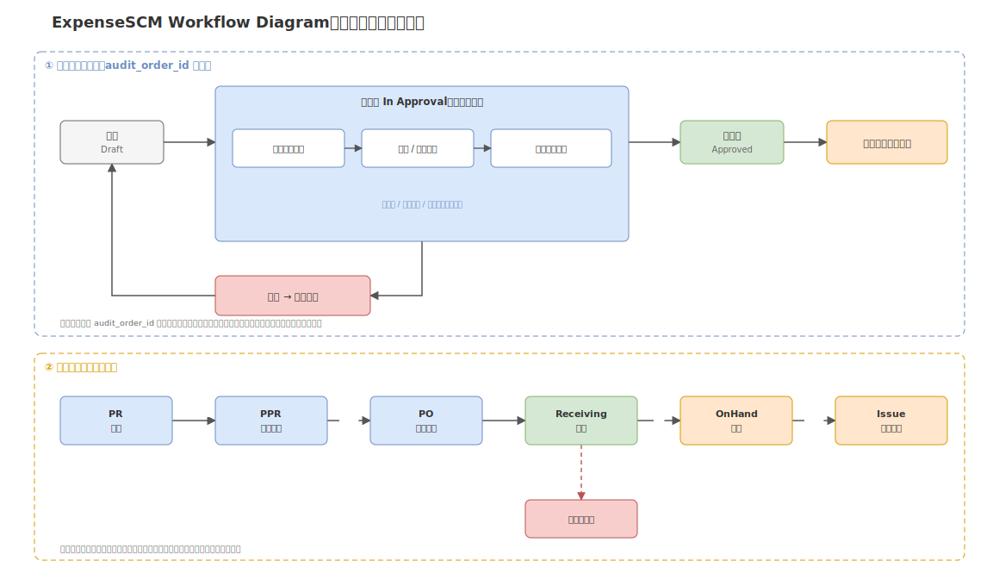
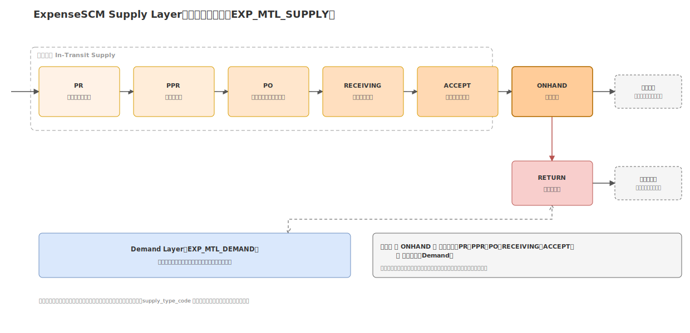
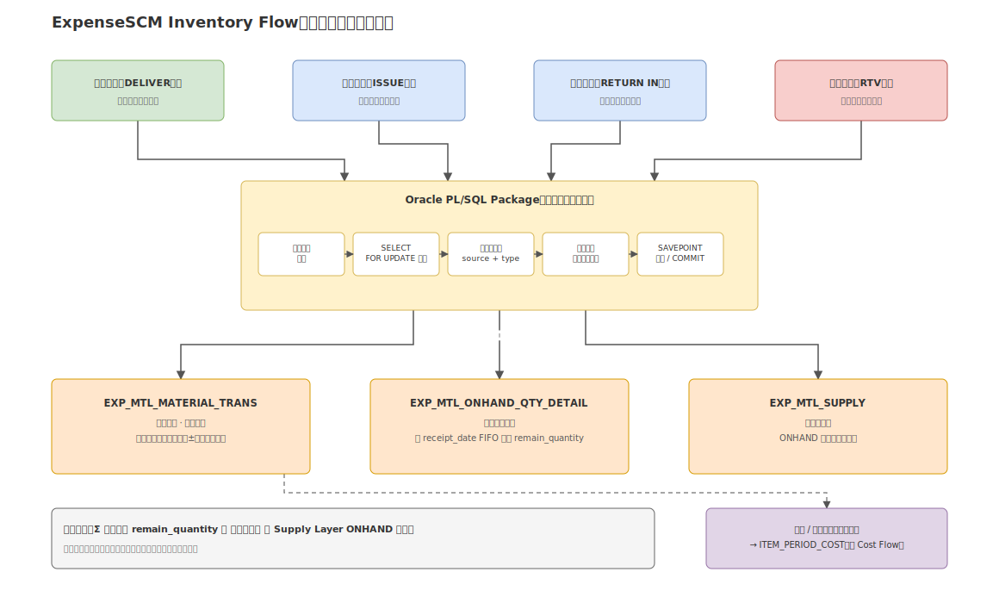
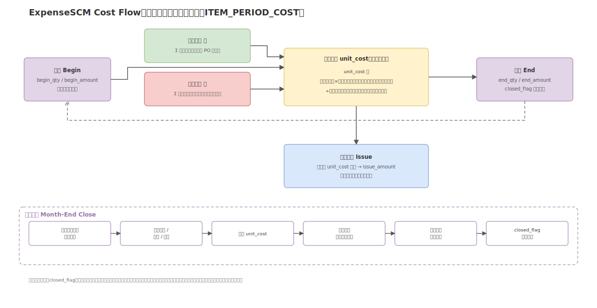

# Diagrams｜ExpenseSCM

> 本页仅作导航摘要，原始图纸与完整说明以 [04_Projects/ExpenseSCM](../../04_Projects/ExpenseSCM/) 为准。

四张核心业务流程图，分别对应审批流转、供需模型、库存事务与成本核算四个技术卖点。

---

## Workflow｜审批流驱动业务流转

## Supply Layer｜七层供需模型

## Inventory Flow｜库存事务与三表协同

## Cost Flow｜月度加权平均成本核算

---

- 完整说明：[系统架构](../../04_Projects/ExpenseSCM/docs/03_System_Architecture.md) / [数据库设计](../../04_Projects/ExpenseSCM/docs/04_Database_Design.md)
- 原始图纸目录：[images/](../../04_Projects/ExpenseSCM/images/)（均含 .drawio 源文件，可直接编辑）

返回 [Portfolio 首页](../README.md)
