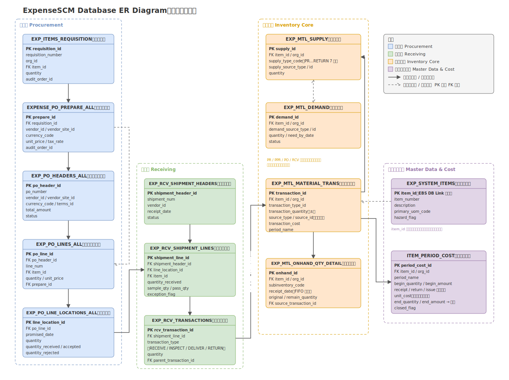

# Database Design｜ExpenseSCM

> ExpenseSCM 核心数据模型与表结构设计，采用 Oracle EBS 风格建模，覆盖请购、采购、验收、库存、领用、退料与月度成本核算全流程。

---

## 1. 数据库设计目标

ExpenseSCM 的数据库不是简单的"业务表堆积"，而是围绕企业费用性供应链的完整生命周期进行建模。设计需要同时解决以下问题：

| 目标 | 说明 |
|------|------|
| 全流程支撑 | 覆盖请购（PR）→ 采购准备（PPR）→ 采购订单（PO）→ 验收（Receiving）→ 入库 → 领用（Issue）→ 退料 / 验退（Return）→ 成本核算（Cost）的完整业务闭环 |
| 多组织隔离 | 通过 `org_id` 支撑多组织业务数据隔离，表名以 `_ALL` 结尾表示跨组织存储、按组织访问，与 Oracle EBS 保持一致 |
| 多角色多状态 | 单据状态由审批流驱动，通过 `audit_order_id` 状态机支撑多角色、多审批节点的流转 |
| 库存事务可追溯 | 任何一笔库存变动都必须能回答"什么时候、什么单据、谁、动了多少" |
| 供需全景可见 | 通过 Supply Layer 七层供需模型，让库存不只反映"在库"，还能反映"在途"和"已预约" |
| 成本可核算 | 支撑月度加权平均成本核算，成本期间可滚动结转，领用出库按当期加权平均成本计价 |
| EBS 集成友好 | 物料主档、供应商、汇率等基础数据与 Oracle EBS 通过 DB Link 同步，表结构与 EBS 命名及主键风格对齐，降低集成映射成本 |

---

## 2. 核心业务实体

核心表关系总览（ER 图）：



系统的核心实体按照业务流顺序组织如下：

| 中文含义 | 英文名称 | 业务作用 | 与其他实体的关系 |
|----------|----------|----------|------------------|
| 请购单 | Purchase Requisition（PR） | 需求部门发起的物料申请，是整条供应链的需求源头 | 审批通过后被采购准备单引用；同时产生 Supply Layer 的 PR 层记录 |
| 采购准备单 | Purchase Prepare Requisition（PPR） | 采购人员维护供应商、单价、币别、税率，可将多张 PR 拼单 | 上游引用 PR，下游按 Vendor / Site / Currency 归并生成 PO |
| 采购订单 | Purchase Order Header（PO） | 与供应商的正式采购契约，头信息记录供应商、币别、付款条件 | 由 PPR 归并生成；下挂采购订单行；驱动收货验收 |
| 采购订单行 | Purchase Order Line | 记录采购的物料、数量、单价 | 属于采购订单；通过发运行与验收关联；对应 Supply Layer 的 PO 层 |
| 验收单 | Receiving Shipment Header | 供应商一次送货对应一张验收单 | 引用 PO；下挂验收单行；驱动验收事务 |
| 验收事务 | Receiving Transaction | 记录收货、检验、入库、退货每一个验收动作 | 属于验收单行；入库动作会触发库存事务 |
| 库存事务 | Material Transaction | 所有库存数量变动的流水账，只增不改 | 由验收入库、领用、退料、验退等业务写入；驱动库存数量明细变动 |
| 库存数量明细 | Onhand Quantity Detail | 按物料、仓库、批次维度记录当前在库数量 | 由库存事务更新；领用时按 FIFO 扣减 |
| 供应层 | Supply Layer | 记录物料在 PR / PPR / PO / RECEIVING / ACCEPT / ONHAND / RETURN 各阶段的数量状态 | 每个业务节点推进时同步流转；与需求层配合做供需匹配 |
| 需求层 | Demand Layer | 记录已提交但尚未满足的物料需求 | 与供应层匹配，避免重复请购 |
| 物料主档 | System Items | 物料基础信息：料号、单位、类别、化学品标识等 | 从 Oracle EBS 同步；被所有业务表通过 `item_id` 引用 |
| 期间成本表 | Item Period Cost | 按物料、按月记录加权平均成本 | 汇总库存事务的入库 / 验退金额；为领用出库提供计价依据 |
| 领用单 | Material Issue Request | 使用部门的领料申请，审批后扣减库存 | 扣减库存数量明细；写入库存事务；消耗 Supply Layer 的 ONHAND 层 |
| 验退单 | Return to Vendor（RTV） | 已入库物料因品质等原因退回供应商 | 反向冲减库存与成本；写入库存事务；进入 Supply Layer 的 RETURN 层 |

---

## 3. 核心表设计

以下选取系统中最能体现设计思路的核心表进行说明（非全部表清单）。

### 3.1 EXP_ITEMS_REQUISITION（请购单）

**表作用**：记录需求部门的请购申请，是供应链的需求入口，也是后续所有单据的追溯源头。

**核心字段**：

| 字段 | 说明 |
|------|------|
| requisition_id | 主键，请购单 ID |
| requisition_number | 请购单号，按组织 + 年月规则编号 |
| org_id | 组织 ID，多组织隔离 |
| item_id | 物料 ID，引用物料主档 |
| quantity | 请购数量 |
| need_by_date | 需求日期 |
| request_dept_id | 需求部门 |
| requestor_id | 申请人 |
| audit_order_id | 审批单 ID，关联审批流，同时充当单据状态机 |
| status | 单据状态（草稿 / 审批中 / 已核准 / 已转采购 / 关闭） |

**设计理由**：请购阶段就引入 `item_id` 强制校验料号，杜绝自由文本描述物料，保证后续采购、库存、成本全链路都能按料号统计。`audit_order_id` 把单据状态交给审批流驱动，页面无法绕过审批修改状态。

**与其他表的关系**：被 `EXPENSE_PO_PREPARE_ALL` 引用（一张 PPR 可拼多张 PR）；核准后在 `EXP_MTL_SUPPLY` 产生 PR 层供应记录。

---

### 3.2 EXPENSE_PO_PREPARE_ALL（采购准备单）

**表作用**：采购人员在 PR 与 PO 之间的作业台，补全商务信息（供应商、单价、币别、税率），并支持多 PR 拼单。

**核心字段**：

| 字段 | 说明 |
|------|------|
| prepare_id | 主键 |
| requisition_id | 来源请购单 ID |
| org_id | 组织 ID |
| vendor_id / vendor_site_id | 供应商及供应商地点 |
| currency_code | 币别 |
| unit_price | 采购单价 |
| tax_rate | 税率 |
| delivery_method | 交货方式 |
| audit_order_id | 采购审批流 |

**设计理由**：如果让 PR 直接生成 PO，采购议价、换供应商、拼单都要回头改 PR，破坏需求数据。独立出 PPR 层，让"需求"与"商务条件"解耦：PR 只表达要什么，PPR 决定向谁买、什么价格买。

**与其他表的关系**：上游引用 `EXP_ITEMS_REQUISITION`；审批通过后按 Vendor + Site + Currency + Tax + Terms 归并生成 `EXP_PO_HEADERS_ALL` 与 `EXP_PO_LINES_ALL`；供应层记录从 PR 层流转到 PPR 层。

---

### 3.3 EXP_PO_HEADERS_ALL（采购订单头）

**表作用**：与供应商的正式采购契约，一张 PO 对应一个供应商 + 一种币别 + 一组付款条件。

**核心字段**：

| 字段 | 说明 |
|------|------|
| po_header_id | 主键 |
| po_number | PO 单号 |
| org_id | 组织 ID |
| vendor_id / vendor_site_id | 供应商 / 供应商地点 |
| currency_code | 币别 |
| terms_id | 付款条件 |
| total_amount | 订单总金额 |
| status | 订单状态（开立 / 已核准 / 部分收货 / 关闭 / 取消） |

**设计理由**：头行分离是 ERP 采购模型的基本形态。头承载商务条件（对供应商），行承载物料明细（对库存与成本），两者变更频率和权限都不同。归并规则（同 Vendor / Site / Currency / Tax / Terms 合并为一张 PO）在生成时固化，减少供应商对账成本。

**与其他表的关系**：下挂 `EXP_PO_LINES_ALL`；被 `EXP_RCV_SHIPMENT_HEADERS` 引用。

---

### 3.4 EXP_PO_LINES_ALL（采购订单行）

**表作用**：记录 PO 中每个物料的数量与价格，是采购数量控制的核心。

**核心字段**：

| 字段 | 说明 |
|------|------|
| po_line_id | 主键 |
| po_header_id | 所属订单头 |
| line_num | 行号 |
| item_id | 物料 ID |
| quantity | 订购数量 |
| unit_price | 单价 |
| prepare_id | 来源 PPR，保留追溯链 |

**设计理由**：行上保留 `prepare_id`，使 PO 行可以一直追溯到 PPR 再到 PR，回答"这行采购是谁、什么时候、为什么提的需求"。

**与其他表的关系**：属于 `EXP_PO_HEADERS_ALL`；下挂 `EXP_PO_LINE_LOCATIONS_ALL`；对应 `EXP_MTL_SUPPLY` 的 PO 层记录。

---

### 3.5 EXP_PO_LINE_LOCATIONS_ALL（采购订单发运行）

**表作用**：记录 PO 行的收货地点、分批交期与收货进度，是"订了多少、到了多少、还欠多少"的控制点。

**核心字段**：

| 字段 | 说明 |
|------|------|
| line_location_id | 主键 |
| po_line_id | 所属 PO 行 |
| ship_to_location_id | 收货地点 |
| promised_date | 承诺交期 |
| quantity | 应收数量 |
| quantity_received | 已收数量 |
| quantity_accepted | 已验收合格数量 |
| quantity_rejected | 已拒收数量 |
| closed_flag | 收货关闭标记 |

**设计理由**：同一 PO 行可能分批到货、分地点收货。把收货进度放在发运行而不是 PO 行上，收货核销（已收 / 合格 / 拒收）互不干扰，也与 EBS 的 `PO_LINE_LOCATIONS_ALL` 模型一致。

**与其他表的关系**：属于 `EXP_PO_LINES_ALL`；被 `EXP_RCV_SHIPMENT_LINES` 引用做收货核销。

---

### 3.6 EXP_RCV_SHIPMENT_HEADERS（验收单头）

**表作用**：供应商一次送货登记一张验收单，记录送货单号、送货日期、供应商信息。

**核心字段**：

| 字段 | 说明 |
|------|------|
| shipment_header_id | 主键 |
| shipment_num | 送货单号 |
| vendor_id | 供应商 |
| org_id | 组织 ID |
| shipped_date / receipt_date | 送货 / 收货日期 |
| status | 验收状态 |

**设计理由**：一次送货可能包含多张 PO 的多个物料，因此验收单不直接挂在 PO 下，而是独立建模、行级关联 PO 发运行。

**与其他表的关系**：下挂 `EXP_RCV_SHIPMENT_LINES`；间接引用 `EXP_PO_HEADERS_ALL`。

---

### 3.7 EXP_RCV_SHIPMENT_LINES（验收单行）

**表作用**：记录本次送货每个物料的到货数量、抽样数量、检验结果，承载 `Delivery ≤ Pass ≤ Sample ≤ Receive` 的数量约束。

**核心字段**：

| 字段 | 说明 |
|------|------|
| shipment_line_id | 主键 |
| shipment_header_id | 所属验收单 |
| line_location_id | 对应 PO 发运行 |
| item_id | 物料 ID |
| quantity_shipped | 送货数量 |
| quantity_received | 实收数量 |
| sample_qty | 抽样数量 |
| pass_qty | 检验合格数量 |
| exception_flag | 收料异常标记（如化学品缺 SGS / MSDS） |

**设计理由**：抽样与检验数量直接建在验收行上，数量约束在数据库层校验而不是只靠页面。异常标记使收料异常单可以阻断后续入库流程。

**与其他表的关系**：属于 `EXP_RCV_SHIPMENT_HEADERS`；引用 `EXP_PO_LINE_LOCATIONS_ALL` 做核销；下挂 `EXP_RCV_TRANSACTIONS`。

---

### 3.8 EXP_RCV_TRANSACTIONS（验收事务）

**表作用**：记录验收环节的每个动作（RECEIVE 收货、INSPECT 检验、DELIVER 入库、RETURN 退供应商），是验收环节的事务流水。

**核心字段**：

| 字段 | 说明 |
|------|------|
| rcv_transaction_id | 主键 |
| shipment_line_id | 所属验收行 |
| transaction_type | 事务类型（RECEIVE / INSPECT / DELIVER / RETURN） |
| quantity | 事务数量 |
| transaction_date | 事务时间 |
| parent_transaction_id | 父事务 ID，构成事务链 |
| employee_id | 操作人 |

**设计理由**：验收不是一个动作而是一条链（收货 → 检验 → 入库 / 退回）。`parent_transaction_id` 把动作串成树，退货时可以精确指认冲销哪一笔收货，这是 EBS 收货模型的核心机制。

**与其他表的关系**：属于 `EXP_RCV_SHIPMENT_LINES`；DELIVER / RETURN 类型的事务触发 `EXP_MTL_MATERIAL_TRANS` 写入。

---

### 3.9 EXP_MTL_MATERIAL_TRANS（库存事务）

**表作用**：全系统唯一的库存变动流水账。任何入库、领用、退料、验退都必须在此留痕，只插入、不修改。

**核心字段**：

| 字段 | 说明 |
|------|------|
| transaction_id | 主键 |
| item_id | 物料 ID |
| org_id / subinventory_code | 组织 / 仓库 |
| transaction_type_id | 事务类型（入库 / 领用 / 退料入库 / 验退出库） |
| transaction_quantity | 事务数量（入库为正，出库为负） |
| transaction_date | 事务时间 |
| source_type / source_id | 来源单据类型与 ID（PO 验收、领用单、验退单） |
| transaction_cost | 事务成本（按当期加权平均成本计价） |
| period_name | 所属成本期间 |

**设计理由**：库存表只能回答"现在有多少"，事务表回答"怎么变成这样的"。`source_type + source_id + transaction_type_id` 构成幂等键，同一单据的同一动作不会重复过账。事务上冗余 `transaction_cost` 与 `period_name`，月结时不需要回溯重算。

**与其他表的关系**：由验收、领用、验退业务写入；每笔事务同步更新 `EXP_MTL_ONHAND_QTY_DETAIL` 与 `EXP_MTL_SUPPLY`；金额汇总进入 `ITEM_PERIOD_COST`。

---

### 3.10 EXP_MTL_ONHAND_QTY_DETAIL（库存数量明细）

**表作用**：按物料 + 仓库 + 入库批次维度记录当前在库数量，是领用扣减的直接操作对象。

**核心字段**：

| 字段 | 说明 |
|------|------|
| onhand_id | 主键 |
| item_id | 物料 ID |
| org_id / subinventory_code | 组织 / 仓库 |
| receipt_date | 入库日期（FIFO 排序依据） |
| original_quantity | 入库原始数量 |
| remain_quantity | 当前剩余数量 |
| source_transaction_id | 来源入库事务 |

**设计理由**：不使用"一个物料一行汇总数量"的做法，而是按入库批次保留明细行。这样领用可以严格按 `receipt_date` FIFO 扣减，每一笔在库数量都能追溯到入库事务，盘点差异也能定位到批次。

**与其他表的关系**：由 `EXP_MTL_MATERIAL_TRANS` 的入库事务创建、出库事务扣减；`remain_quantity` 汇总应始终与事务表净额一致，作为对账校验点。

---

### 3.11 EXP_MTL_SUPPLY（供应层 Supply Layer）

**表作用**：记录物料在供应链各阶段（PR / PPR / PO / RECEIVING / ACCEPT / ONHAND / RETURN）的数量分布，提供"供应全景"。

**核心字段**：

| 字段 | 说明 |
|------|------|
| supply_id | 主键 |
| item_id | 物料 ID |
| org_id | 组织 ID |
| supply_type_code | 供应层类型（PR / PPR / PO / RECEIVING / ACCEPT / ONHAND / RETURN） |
| supply_source_type / supply_source_id | 来源单据类型与 ID |
| quantity | 该层当前数量 |
| expected_date | 预计可用日期 |

**设计理由**：详见第 5 节。核心是让"在途供应"成为一等公民，请购校验时可以看到"已请购未到货"的数量，避免重复采购。

**与其他表的关系**：每个业务节点推进时，数量从上一层流转到下一层；与 `EXP_MTL_DEMAND` 配合做供需匹配。

---

### 3.12 EXP_MTL_DEMAND（需求层 Demand Layer）

**表作用**：记录已提交但尚未被满足的物料需求（待批领用、已核准未发料的申请）。

**核心字段**：

| 字段 | 说明 |
|------|------|
| demand_id | 主键 |
| item_id | 物料 ID |
| org_id | 组织 ID |
| demand_source_type / demand_source_id | 需求来源单据 |
| quantity | 需求数量 |
| need_by_date | 需求日期 |
| status | 需求状态（开放 / 已满足 / 取消） |

**设计理由**：只有供应视图没有需求视图，"可用量"就是错的。可用量 = ONHAND + 在途供应 − 开放需求。需求层让领用预约在核准时刻就占用可用量，避免"账上有货、实际已被预约"的超发。

**与其他表的关系**：领用申请核准时写入；发料完成后关闭；与 `EXP_MTL_SUPPLY` 共同支撑请购校验与可用量计算。

---

### 3.13 EXP_SYSTEM_ITEMS（物料主档）

**表作用**：物料基础数据的唯一来源，从 Oracle EBS 通过 DB Link 同步。

**核心字段**：

| 字段 | 说明 |
|------|------|
| item_id | 主键，与 EBS `INVENTORY_ITEM_ID` 对齐 |
| item_number | 料号 |
| description | 品名描述 |
| primary_uom_code | 基本单位 |
| item_category | 物料类别 |
| hazard_flag | 化学品 / 危险品标识 |
| enabled_flag | 启用状态 |
| last_sync_date | 最近同步时间 |

**设计理由**：物料主数据以 EBS 为准、本地只读同步，保证两套系统按同一 `item_id` 说话，验收入库回写 EBS 时不需要做料号映射。`hazard_flag` 支撑收料时化学品 SGS / MSDS 附件的强制校验。

**与其他表的关系**：被所有业务表通过 `item_id` 引用；是 `ITEM_PERIOD_COST` 的统计维度。

---

### 3.14 ITEM_PERIOD_COST（期间成本表）

**表作用**：按物料 + 成本期间（月）记录加权平均成本，是领用计价与财务月结的依据。

**核心字段**：

| 字段 | 说明 |
|------|------|
| period_cost_id | 主键 |
| item_id | 物料 ID |
| org_id | 组织 ID |
| period_name | 成本期间（如 2025-06） |
| begin_quantity / begin_amount | 期初数量 / 期初金额 |
| receipt_quantity / receipt_amount | 本期入库数量 / 金额 |
| return_quantity / return_amount | 本期验退数量 / 金额 |
| issue_quantity / issue_amount | 本期领用数量 / 金额 |
| unit_cost | 当期加权平均单位成本 |
| end_quantity / end_amount | 期末数量 / 金额（结转下期期初） |
| closed_flag | 期间关闭标记 |

**设计理由**：详见第 7 节。数量与金额分开存储、期末滚动结转，任何一个期间的成本都可以独立复算与审计。

**与其他表的关系**：数据来源于 `EXP_MTL_MATERIAL_TRANS` 按期间汇总；`unit_cost` 反过来为出库事务提供计价。

---

## 4. 主业务数据流

主流程 **PR → PPR → PO → Receiving → Inventory → Issue → Cost** 中，每一步的表变化如下：

| 阶段 | 业务动作 | 表变化 |
|------|----------|--------|
| ① PR | 需求部门提交请购，审批核准 | 写入 `EXP_ITEMS_REQUISITION`；核准后 `EXP_MTL_SUPPLY` 新增 PR 层记录 |
| ② PPR | 采购维护供应商 / 价格，可拼单 | 写入 `EXPENSE_PO_PREPARE_ALL`；供应层数量从 PR 层流转到 PPR 层 |
| ③ PO | 按 Vendor / Site / Currency 归并生成订单 | 写入 `EXP_PO_HEADERS_ALL` / `EXP_PO_LINES_ALL` / `EXP_PO_LINE_LOCATIONS_ALL`；供应层流转到 PO 层 |
| ④ Receiving | 供应商送货，收货 → 抽样 → 检验 | 写入 `EXP_RCV_SHIPMENT_HEADERS` / `EXP_RCV_SHIPMENT_LINES`，每个动作写 `EXP_RCV_TRANSACTIONS`；发运行核销 `quantity_received`；供应层流转到 RECEIVING → ACCEPT 层 |
| ⑤ Inventory | 检验合格入库 | `EXP_RCV_TRANSACTIONS` 写入 DELIVER 事务；`EXP_MTL_MATERIAL_TRANS` 写入入库事务；`EXP_MTL_ONHAND_QTY_DETAIL` 新增批次行；供应层流转到 ONHAND 层 |
| ⑥ Issue | 领用申请核准后发料 | 核准时写 `EXP_MTL_DEMAND`；发料时 `EXP_MTL_MATERIAL_TRANS` 写出库事务，`EXP_MTL_ONHAND_QTY_DETAIL` 按 FIFO 扣减 `remain_quantity`，需求关闭，ONHAND 层减少 |
| ⑦ Cost | 月末成本核算 | 按 `period_name` 汇总 `EXP_MTL_MATERIAL_TRANS` 的入库 / 验退金额，计算 `ITEM_PERIOD_COST.unit_cost`，期末结转下期期初 |

验退（RTV）是主流程的逆向分支：`EXP_RCV_TRANSACTIONS` 写 RETURN 事务 → `EXP_MTL_MATERIAL_TRANS` 写验退出库 → 在库批次冲减 → 供应层进入 RETURN 层 → 期间成本表冲减本期入库金额。

---

## 5. Supply Layer 数据模型

### 5.1 七层供应状态

`EXP_MTL_SUPPLY` 以 `supply_type_code` 表达物料在供应链上的位置：

| 层 | 含义 | 进入时机 | 离开时机 |
|----|------|----------|----------|
| PR | 已请购、未转采购 | 请购单核准 | 转入 PPR |
| PPR | 采购准备中 | PPR 建立 | 生成 PO |
| PO | 已下单、供应商未交货 | PO 核准 | 供应商送货 |
| RECEIVING | 已到货、检验中 | 收货登记 | 检验完成 |
| ACCEPT | 检验合格、待入库 | 检验合格 | 入库过账 |
| ONHAND | 在库可用 | 入库完成 | 领用出库 |
| RETURN | 验退处理中 | 验退单建立 | 退厂完成 |

业务每推进一个节点，对应数量就从上一层扣减、在下一层增加，整条供应链的数量守恒。

### 5.2 为什么不用单一库存表

传统做法只维护一张在库数量表，能回答"仓库里有多少"，但回答不了：

- **这个料还有多少在途？**——请购人看到库存为零就重复请购，实际上上周的 PO 下周就到货；
- **可用量到底是多少？**——账上 100 个，其中 80 个已被核准领用预约，实际可用只有 20 个；
- **需求卡在哪个环节？**——催料时无法快速定位物料是卡在采购、在途还是检验。

引入 Supply Layer 后：

- 请购校验时按 `ONHAND + 在途各层 − 开放需求` 计算可用量，从数据模型层面抑制重复采购；
- 每一层数量都挂着 `supply_source_id`，催料可以直接定位到具体 PO 或验收单；
- 供应层与 `EXP_MTL_DEMAND` 需求层配合，构成完整的供需匹配视图，这是参考 Oracle EBS `MTL_SUPPLY` / `MTL_DEMAND` 的建模思路。

---

## 6. 库存事务设计

### 6.1 四类库存事务

| 事务 | 方向 | 触发单据 | 数量影响 |
|------|------|----------|----------|
| 入库事务 | + | 验收单（检验合格入库） | 新增在库批次，ONHAND 层增加 |
| 领用事务 | − | 领用单（审批通过发料） | FIFO 扣减在库批次，ONHAND 层减少 |
| 退回事务 | + | 退料单（领用后退回仓库） | 按原批次回增 `remain_quantity` |
| 验退事务 | − | 验退单（品质不合格退供应商） | 冲减在库批次，进入 RETURN 层，冲减本期入库金额 |

### 6.2 三张表的分工

库存的"当前状态"和"历史过程"由三张表配合表达：

| 表 | 角色 | 回答的问题 |
|----|------|------------|
| `EXP_MTL_MATERIAL_TRANS` | 事务历史（流水账，只增不改） | 库存是怎么变成现在这样的？每一笔变动来自哪张单据、谁操作、何时发生？ |
| `EXP_MTL_ONHAND_QTY_DETAIL` | 当前数量（按入库批次） | 现在每个仓库、每个批次还剩多少？领用应该先扣哪一批？ |
| `EXP_MTL_SUPPLY` | 当前供应状态（按供应链阶段） | 除了在库，还有多少在请购、在途、在检验？ |

三者的一致性约束是：**在库明细的剩余数量合计 = 事务表的净额 = 供应层 ONHAND 层数量**。任何一笔业务过账都在同一个数据库事务内同时更新三张表（由 PL/SQL Package 保证，见第 8 节），因此任意时点三个视图都可交叉对账，库存差异可以精确定位到某一笔事务。

---

## 7. 成本核算数据模型

### 7.1 月度加权平均成本

系统采用**月度加权平均法**：以自然月为成本期间，期间内所有入库按实际采购价累计金额，月末统一计算当期单位成本。

```text
当期单位成本 =
（期初成本 × 期初数量 + 本期入库金额 − 本期验退金额）
÷
（期初数量 + 本期入库数量 − 本期验退数量）
```

对应 `ITEM_PERIOD_COST` 的字段关系：

| 公式项 | 对应字段 | 数据来源 |
|--------|----------|----------|
| 期初成本 × 期初数量 | begin_amount | 上期 end_amount 结转 |
| 本期入库金额 / 数量 | receipt_amount / receipt_quantity | 汇总本期入库类库存事务（按 PO 单价计价） |
| 本期验退金额 / 数量 | return_amount / return_quantity | 汇总本期验退类库存事务（按原入库成本冲减） |
| 当期单位成本 | unit_cost | 月结时计算 |
| 期末金额 / 数量 | end_amount / end_quantity | 结转为下期 begin |

### 7.2 领用不参与单位成本重算

设计上的一个关键取舍：**领用出库不改变单位成本，只按当期加权平均成本计价**。

- 入库和验退改变的是"库存的价值构成"，所以参与单位成本计算；
- 领用只是把已有价值转出，按 `unit_cost × 领用数量` 记入 `issue_amount`，不影响分子分母；
- 这样避免了每笔领用触发成本重算（移动加权平均的做法），月内领用成本稳定一致，财务对账和费用分摊口径清晰，也符合费用性物料"重期间归集、轻单笔精度"的核算特点。

### 7.3 期间滚动结转

月结流程：校验本期事务全部过账 → 汇总入库 / 验退 / 领用 → 计算 `unit_cost` → 回写本期出库事务成本 → 期末结转下期期初 → 置 `closed_flag` 关闭期间。期间一旦关闭不允许再过账入该期间，保证已出具的财务数据不被追溯篡改。

---

## 8. 数据一致性设计

企业库存与成本数据最怕"账实不符"。系统在数据库层做了五重一致性保障：

| 机制 | 做法 | 解决的问题 |
|------|------|------------|
| 状态机驱动 | 单据状态统一由 `audit_order_id` 关联的审批流驱动，业务写操作前校验单据处于合法状态 | 防止绕过审批修改数据、防止状态跳跃（如未核准就发料） |
| PL/SQL Package 事务封装 | 验收入库、领用扣减、验退、月结等涉及 5 张以上表联动的操作，全部封装在 Oracle PL/SQL Package 内的单一事务中完成 | 多表更新要么全部成功、要么全部失败，避免应用层拆散事务造成的中间状态 |
| SELECT FOR UPDATE 行锁 | 扣减库存前对 `EXP_MTL_ONHAND_QTY_DETAIL` 目标批次行加行锁，再校验 `remain_quantity` 是否充足 | 防止并发领用同一批次导致超扣、负库存 |
| 幂等键 | `EXP_MTL_MATERIAL_TRANS` 上以 `source_type + source_id + transaction_type_id` 建唯一约束 | 同一单据同一动作重复提交（网络重试、重复点击）不会产生重复事务 |
| SAVEPOINT 回滚控制 | Package 内多步骤操作设置 SAVEPOINT，某一步失败时回滚到既定保存点并返回明确错误码 | 长事务中部分失败可控回退，错误信息可定位到具体步骤 |

这五个机制层层配合：状态机挡住非法入口，行锁挡住并发冲突，幂等键挡住重复提交，Package + SAVEPOINT 保证过程原子，最终实现第 6 节所述"三表恒等"的对账关系。

---

## 9. 数据库设计亮点

面向面试整理的核心亮点：

1. **Supply Layer 七层供需追踪**——参考 Oracle EBS `MTL_SUPPLY` 思路，把 PR / PPR / PO / RECEIVING / ACCEPT / ONHAND / RETURN 建成统一供应视图，解决传统库存表看不到在途和预约的问题，从数据模型层面抑制重复采购。
2. **月度加权平均成本模型**——数量与金额双维记账、期末滚动结转、期间关闭防篡改；领用按当期成本计价而不触发重算，是针对费用性物料核算特点的明确取舍。
3. **库存全程可追溯**——事务流水（只增不改）+ 批次级在库明细 + 供应层三表分工，任意库存数字都能追溯到具体单据、操作人和时间，且三表可交叉对账。
4. **PL/SQL Package 事务一致性**——复杂多表联动下沉数据库，配合 SELECT FOR UPDATE 行锁、幂等唯一键、SAVEPOINT，保证并发和重试场景下的账实一致。
5. **全链路单据建模**——PR → PPR → PO（头 / 行 / 发运行）→ RCV（头 / 行 / 事务）→ Inventory 每个环节独立建模、外键链完整，任何一行采购都能双向追溯。
6. **Oracle EBS 风格的数据结构**——`_ALL` 多组织模式、头行分离、事务父子链、主数据 DB Link 同步，与 EBS 集成时无需额外映射层，也降低了熟悉 EBS 的团队的维护成本。

---

## 10. 面试表达总结

> 这个系统的数据库设计，我是按照 Oracle EBS 的建模思路来做的。整个费用性供应链从请购、采购准备、采购订单，到验收、入库、领用、验退，每个环节都独立建模，通过外键链保证任何一笔数据都能双向追溯。库存部分我用了三张表配合：事务表记历史、在库明细表记批次数量、Supply Layer 记供应链状态，三张表金额数量恒等，可以交叉对账。Supply Layer 是设计上的重点，它把物料在请购、在途、检验、在库、验退七个阶段的数量都管起来，解决了传统库存表看不到在途量、算不准可用量的问题。成本上采用月度加权平均，数量金额分开记账、期末滚动结转，领用按当期成本计价不触发重算。一致性方面，复杂的多表事务都封装在 PL/SQL Package 里，配合行锁、幂等键和 SAVEPOINT，保证并发领用和重复提交场景下账实一致。

---

## 相关文档

- [系统架构](03_System_Architecture.md)
- [业务流程](02_Business_Process.md)
- [技术亮点](05_Technical_Highlights.md)
- 返回 [项目首页](../README.md)
