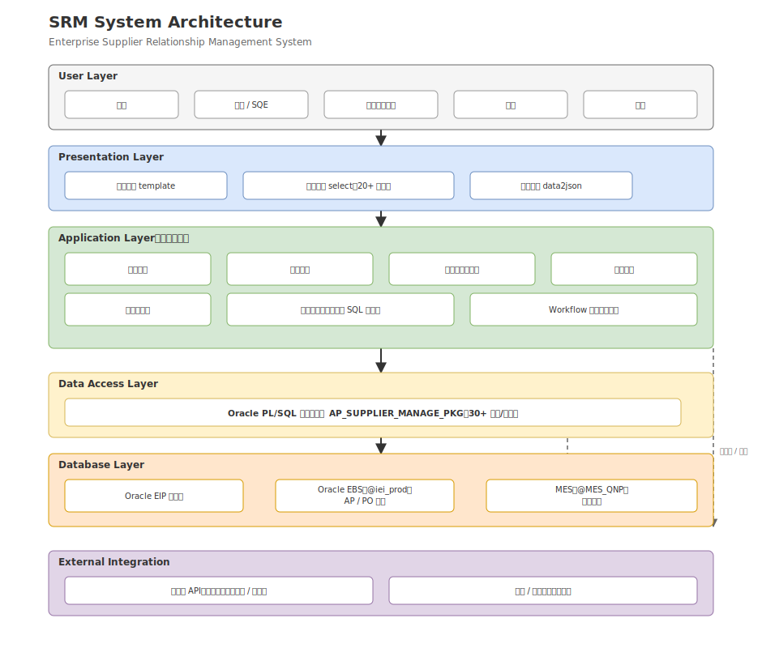

# SRM｜企业供应商关系管理系统

> EIP/EIMP（企业信息门户）系统中 SRM（供应商关系管理）核心子系统，覆盖供应商从建立申请、资料完善、多级签核、抛转 ERP、资料变更、评鉴稽核到绩效评分统计的全生命周期管理。


---

# 🏗 系统架构

> 系统总体架构图



---

# 📌 项目简介

供应商管理模块是公司 EIP/EIMP 系统中 SRM（供应商关系管理）的核心子系统，覆盖供应商从建立申请 → 资料完善 → 多级签核 → 抛转 ERP → 资料变更 → 评鉴稽核 → 绩效评分统计的全生命周期管理。

系统采用前后端分离的轻量 Web 架构，后端基于自研 Eip 框架（Python），通过数据库链路（DB Link）与 Oracle EBS（ERP）正式库实时交互，业务逻辑下沉到 Oracle PL/SQL 存储过程包，并接入公司统一的工作流签核引擎与企业微信、邮件等通知渠道。模块同时支持多组织（境内外子公司）差异化业务规则与中英文双语单据。

系统覆盖：

- 供应商建立申请
- 供应商资料完善
- 多级工作流签核
- 抛转 ERP（AP/PO）
- 供应商资料变更
- 供应商查询与合约附档管理
- 供应商评鉴表与稽核计划
- 供应商配合性评分
- 供应商绩效评分统计
- 体系文件 / 合约 / 代理资格到期提醒

---

# ✨ 项目亮点

- 企业级 SRM（供应商关系管理）系统，覆盖供应商全生命周期管理
- 打通 EIP 与 Oracle EBS（AP/PO）双库，erp_ / eip_ 双轨标识 + 中间表 + Merge 回写机制
- 配置化 + 动态 SQL：权重字典 + 占位符模板驱动多组织、多周期、多维度绩效评分统计
- 复杂校验规则引擎：组织 × 供应商类型 × 特殊产品维度的建档/变更防呆校验
- Oracle PL/SQL 存储过程包（30+ 过程/函数）+ 工作流节点钩子驱动端到端自动化
- 跨库多源整合：DB Link 打通 EBS（@iei_prod）、EIP、MES（@MES_QNP）
- 多组织（境内外子公司）差异化业务规则与中英文双语支持
- 集成启信宝 API 实现企业工商信息自动校验与供应商查重

---

# 🛠 技术栈

| 分类 | 技术 |
|------|------|
| 后端 | Python（自研 Eip 框架） |
| 数据库 | Oracle、PL/SQL 存储过程包 |
| 工作流 | 公司统一签核流引擎（workflow_create / workflow_audit） |
| 集成 | Oracle EBS（AP/PO）、MES、DB Link、启信宝 API |
| 通知 | 邮件、企业微信 |
| 前端 | 模板渲染（template）、动态下拉（select）、数据网格（data2json） |

---

# 📚 项目文档

**核心技术文档**

| 文档 | 内容 |
|------|------|
| [项目概述](docs/01_Project_Overview.md) | 项目背景、建设目标及职责 |
| [业务流程](docs/02_Business_Process.md) | 供应商全生命周期业务流程 |
| [系统架构](docs/03_System_Architecture.md) | 系统分层架构设计 |

后续文档（数据库设计、技术亮点、面试案例等）按 Milestone 逐步推进，见 [PROJECT.md](PROJECT.md)。

---

# 📂 项目结构

```text
SRM
│
├── README.md                项目首页
├── PROJECT.md               项目开发看板
│
├── docs                     项目文档
│   ├── 01_Project_Overview.md
│   ├── 02_Business_Process.md
│   └── 03_System_Architecture.md
│
├── images                   架构图、流程图、ER 图
│
└── assets                   附件、示例文件
```

---

# 🚀 当前建设进度

- ✅ 项目概述 / 业务流程 / 系统架构
- ⏳ 数据库设计 / ER 图
- ⏳ 核心流程图（评鉴流程 / 绩效评分统计流程 / EIP-ERP 数据回写流程）
- ⏳ 技术亮点 / STAR 面试案例 / 面试问答 / 简历项目描述

---

# 👨‍💻 我的职责

我在项目中主要负责：

- 供应商建档 / 资料变更 / 查询 / 评鉴 / 绩效评分统计模块设计与开发
- Oracle PL/SQL 存储过程包开发（AP_SUPPLIER_MANAGE_PKG）
- 工作流签核引擎对接（流程节点钩子驱动业务逻辑）
- 跨系统集成（Oracle EBS、MES、启信宝 API）
- 动态 SQL 引擎设计（多组织差异化绩效评分统计）
- 系统测试、上线及维护

---

# 🎯 项目价值

SRM 将供应商建档、变更、评鉴、抛转 ERP 等原本分散的线下/人工流程统一线上化、流程化、自动化，覆盖多家境内外子公司。

通过查重、强校验与自动回写 ERP，保障了供应商主数据质量与 EIP-ERP 一致性；多维度加权评分统计为采购、品保提供了供应商绩效量化依据与分级管理支撑；体系文件、合约、代理资格到期自动提醒，降低了合规与履约风险。
