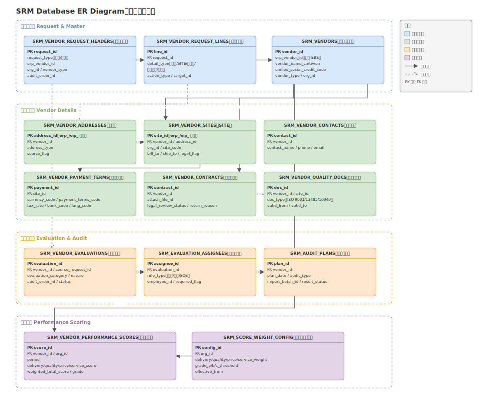

# Database Design｜SRM

> SRM 核心数据模型与表结构设计，覆盖供应商建档、变更、评鉴、稽核与绩效评分统计全流程，重点体现 EIP-ERP 双轨数据一致性与配置化动态 SQL 设计。

---

## 1. 数据库设计目标

SRM 的数据库设计围绕供应商主数据从建立到绩效评估的完整生命周期展开，需要同时解决以下问题：

| 目标 | 说明 |
|------|------|
| 全流程支撑 | 覆盖供应商建档、资料完善、多级签核、抛转 ERP、资料变更、查询、评鉴稽核、绩效评分统计、到期提醒的完整业务闭环 |
| EIP-ERP 双轨一致性 | 供应商数据在签核通过前存在于 EIP 本地，通过后需回写 Oracle EBS 正式表；数据模型要能同时表达"来自 EIP"和"来自 ERP"两类记录并保证一致 |
| 多组织差异化 | 通过 `org_id` 支撑境内外多家子公司的差异化审批规则、评分权重、单据校验规则 |
| 强校验与查重 | 支撑组织 × 供应商类型 × 特殊产品维度的建档/变更防呆校验，以及供应商查重（名称模糊匹配 + 统一社会信用代码） |
| 工作流驱动自动化 | 支撑签核节点钩子触发的自动评鉴创建、自动编码生成、自动抛转 ERP、自动通知 |
| 绩效评分可配置 | 支撑按组织差异化的评分维度权重与分级阈值，驱动动态 SQL 生成多周期、多维度统计 |
| 跨系统集成友好 | 与 Oracle EBS（AP/PO）、MES、启信宝 API 的数据交互路径清晰，不侵入核心业务表结构 |

---

## 2. 核心业务实体

核心表关系总览（ER 图）：



系统的核心实体组织如下：

| 中文含义 | 英文名称 | 业务作用 | 与其他实体的关系 |
|----------|----------|----------|------------------|
| 建档/变更申请单头 | Vendor Request Header | 供应商建立或资料变更的主单据，是审批流程的载体 | 关联供应商主档；下挂申请明细；驱动评鉴单与 ERP 抛转 |
| 建档/变更申请明细 | Vendor Request Line | 申请单下地址/SITE/联络人/付款资料/合约附档五类明细的变更内容（新增/修改/失效） | 属于申请单头；签核通过后回写对应明细主表 |
| 供应商主档 | Vendor Master | EIP 侧维护的供应商基本信息，与 Oracle EBS 供应商表通过 `erp_vendor_id` 关联 | 被地址、SITE、联络人、付款资料、评鉴单、绩效评分等实体引用 |
| 供应商地址 | Vendor Address | 供应商的账单/收货/法定注册地址等，支持 `erp_` / `eip_` 双轨标识 | 属于供应商主档；被 SITE 引用 |
| 供应商 SITE | Vendor Site | 供应商在特定组织下的交易地点，与 ERP Vendor Site 对应 | 属于供应商主档；引用地址；被付款资料、采购单引用 |
| 供应商联络人 | Vendor Contact | 供应商对接窗口人员信息 | 属于供应商主档，按 SITE 维度可能不同 |
| 供应商付款资料 | Vendor Payment Terms | 币别、交易条件、税率、银行/支行等付款相关信息 | 属于供应商 SITE；中英文双语字段支持 CN/TW 与海外站点 |
| 合约附档 | Vendor Contract | 供应商合约文件及法务审核状态 | 属于供应商主档；按 Vendor 汇总加载 |
| 体系文件 | Vendor Quality Document | 供应商 ISO 9001/13485/16949 等质量体系认证文件及有效期 | 属于供应商主档；建档评鉴前置时自动创建对应选项 |
| 评鉴单 | Vendor Evaluation | 记录供应商评鉴过程，含评鉴类别、性质、签核状态 | 由建档/变更签核后自动创建；关联评鉴人员 |
| 评鉴人员 | Evaluation Assignee | 评鉴单指定的评鉴人（采购、品保等角色） | 属于评鉴单；建档时按规则自动指派（采购、品保必选） |
| 稽核计划 | Audit Plan | 供应商稽核排程，支持 Excel 批量导入 | 关联供应商主档；与评鉴单共享稽核结果字段 |
| 绩效评分统计 | Vendor Performance Score | 按周期、维度计算的供应商加权评分与分级结果 | 汇总收料评分、品检数据、服务评分等多源数据；引用评分权重配置 |
| 评分权重配置 | Score Weight Config | 按组织配置的评分维度权重与分级阈值字典 | 被绩效评分统计的动态 SQL 引擎引用 |

---

## 3. 核心表设计

以下选取系统中最能体现设计思路的核心表进行说明（非全部表清单）。

### 3.1 SRM_VENDOR_REQUEST_HEADERS（建档/变更申请单头）

**表作用**：供应商建立申请或资料变更申请的主单据，是审批流程与后续 ERP 回写的入口。

**核心字段**：

| 字段 | 说明 |
|------|------|
| request_id | 主键 |
| request_type | 单据类型（ESTABLISH 建档 / UPDATE 变更） |
| erp_vendor_id | 已存在于 ERP 的供应商 ID（变更单必填，建档单为空） |
| org_id | 组织 ID |
| vendor_type | 供应商类型（驱动动态下拉与校验规则） |
| audit_order_id | 审批单 ID，关联签核流，同时充当单据状态机 |
| status | 单据状态（草稿 / 签核中 / 已核准 / 已抛转 ERP / 驳回） |

**设计理由**：建档与变更共用同一张头表、以 `request_type` 区分，避免两套相似逻辑的单据结构重复维护；`erp_vendor_id` 是否为空天然区分"新建"还是"变更已有供应商"。

**与其他表的关系**：下挂 `SRM_VENDOR_REQUEST_LINES`；签核通过后触发 `SRM_VENDOR_EVALUATIONS` 创建与 ERP 抛转。

---

### 3.2 SRM_VENDOR_REQUEST_LINES（建档/变更申请明细）

**表作用**：记录申请单下地址、SITE、联络人、付款资料、合约附档五类明细的具体变更内容。

**核心字段**：

| 字段 | 说明 |
|------|------|
| line_id | 主键 |
| request_id | 所属申请单头 |
| detail_type | 明细类型（ADDRESS / SITE / CONTACT / PAYMENT / CONTRACT） |
| action_type | 动作类型（新增 / 修改 / 失效） |
| target_id | 目标主表记录 ID（修改/失效时指向对应明细主表；新增时为空） |
| line_data | 本次变更的字段内容（结构化存储，按 detail_type 解释） |

**设计理由**：五类明细的字段结构差异很大（地址 vs 付款资料），如果每类各建一张"申请明细表"会导致五套几乎重复的审批中间表。用 `detail_type + line_data` 的方式统一收敛为一张申请明细表，`target_id` 为空表示新增、非空表示对已有记录的修改或失效，签核通过后按 `detail_type` 路由到对应正式明细表。

**与其他表的关系**：属于 `SRM_VENDOR_REQUEST_HEADERS`；签核通过后由 PL/SQL 存储过程回写 `SRM_VENDOR_ADDRESSES` / `SRM_VENDOR_SITES` / `SRM_VENDOR_CONTACTS` / `SRM_VENDOR_PAYMENT_TERMS` / `SRM_VENDOR_CONTRACTS` 对应正式表。

---

### 3.3 SRM_VENDORS（供应商主档）

**表作用**：EIP 侧维护的供应商基本信息，是 EIP 与 Oracle EBS 供应商主数据的映射锚点。

**核心字段**：

| 字段 | 说明 |
|------|------|
| vendor_id | 主键（EIP 侧 ID） |
| erp_vendor_id | 对应 Oracle EBS `AP_SUPPLIERS.VENDOR_ID`，抛转成功后回写 |
| vendor_name_cn / vendor_name_tw / vendor_name_en | 供应商简体/繁体/英文名称，供查重模糊匹配使用 |
| unified_social_credit_code | 统一社会信用代码，查重关键字段 |
| vendor_type | 供应商类型 |
| org_id | 主建档组织 |
| status | 状态（草稿 / 生效 / 停用） |

**设计理由**：`erp_vendor_id` 在建档抛转成功前为空，成功后回写，这个字段本身就是"是否已落地 ERP"的判断依据，无需额外状态字段冗余表达，详见第 5 节。

**与其他表的关系**：被地址、SITE、联络人、付款资料、评鉴单、绩效评分等表通过 `vendor_id` 引用。

---

### 3.4 SRM_VENDOR_ADDRESSES（供应商地址）

**表作用**：记录供应商的账单地址、收货地址、法定注册地址等，支持 EIP/ERP 双轨来源标识。

**核心字段**：

| 字段 | 说明 |
|------|------|
| address_id | 主键，格式为 `erp_<ERP地址ID>` 或 `eip_<EIP自增ID>` |
| vendor_id | 所属供应商 |
| address_type | 地址类型（Bill to / Ship to / Legal） |
| source_flag | 数据来源（ERP / EIP），与 `address_id` 前缀一致，冗余存储便于查询过滤 |
| address_detail | 地址明细内容 |

**设计理由**：`address_id` 前缀机制是本系统的核心设计（详见第 5 节），让同一张查询视图可以同时展示"已在 ERP 生效"和"EIP 已录入待生效"的地址记录，不需要两套查询逻辑。

**与其他表的关系**：属于 `SRM_VENDORS`；被 `SRM_VENDOR_SITES` 引用。

---

### 3.5 SRM_VENDOR_SITES（供应商 SITE）

**表作用**：记录供应商在特定组织下的交易地点（Site），与 Oracle EBS Vendor Site 对应。

**核心字段**：

| 字段 | 说明 |
|------|------|
| site_id | 主键，同样采用 `erp_` / `eip_` 前缀机制 |
| vendor_id | 所属供应商 |
| org_id | 组织 ID |
| site_code | SITE 编码（长度限制：中文 ≤5 字 / 英文 ≤15 字符） |
| address_id | 关联地址 |
| bill_to_flag / ship_to_flag / legal_flag | 是否作为账单/收货/法定地址（部分供应商类型需三者齐全才允许提交） |

**设计理由**：SITE 编码的长度限制和三类地址标记齐全性校验都是提交强校验规则的直接体现，字段设计上把校验所需的判断依据都落到明确的列，而不是依赖解析字符串。

**与其他表的关系**：属于 `SRM_VENDORS`；引用 `SRM_VENDOR_ADDRESSES`；被 `SRM_VENDOR_PAYMENT_TERMS` 引用。

---

### 3.6 SRM_VENDOR_PAYMENT_TERMS（供应商付款资料）

**表作用**：记录币别、交易条件、税率、银行/支行等付款相关信息，支持中英文双语。

**核心字段**：

| 字段 | 说明 |
|------|------|
| payment_id | 主键 |
| site_id | 所属 SITE |
| currency_code | 币别 |
| payment_terms_code | 交易条件 |
| tax_rate | 税率 |
| bank_code / branch_code | 银行/支行（联动下拉） |
| lang_code | 语言标识（CN / EN），驱动栏位中英文动态切换 |

**设计理由**：`lang_code` 让同一张表支撑境内外站点的双语单据展示需求，避免为海外站点单独建表。

**与其他表的关系**：属于 `SRM_VENDOR_SITES`。

---

### 3.7 SRM_VENDOR_CONTRACTS（合约附档）

**表作用**：记录供应商合约文件及法务审核状态。

**核心字段**：

| 字段 | 说明 |
|------|------|
| contract_id | 主键 |
| vendor_id | 所属供应商 |
| attach_file_id | 附件文件 ID |
| legal_review_status | 法务审核状态（待递交 / 审核中 / 已退回 / 原件已归档） |
| return_reason | 法务退回原因（退回时必填，触发自动邮件通知申请人） |

**设计理由**：法务审核状态作为独立小状态机维护，退回原因与自动通知逻辑绑定在同一条记录上，方便追溯"这份合约是第几次被退回、为什么"。

**与其他表的关系**：属于 `SRM_VENDORS`；按 Vendor 维度跨 org/site 汇总加载。

---

### 3.8 SRM_VENDOR_QUALITY_DOCS（体系文件）

**表作用**：记录供应商 ISO 9001/13485/16949 等质量体系认证文件及有效期，是评鉴前置与到期提醒的数据基础。

**核心字段**：

| 字段 | 说明 |
|------|------|
| doc_id | 主键 |
| vendor_id | 所属供应商 |
| site_id | 所属 SITE（体系文件可能按 SITE 维度免重复上传，见 4.8） |
| doc_type | 体系文件类型（ISO 9001 / 13485 / 16949 等） |
| valid_from / valid_to | 有效期起止 |
| reminder_sent_flag | 到期提醒是否已发送 |

**设计理由**：`site_id` 维度的设计支撑"新增 SITE 是否需要重新上传评鉴附档"的判断——同一供应商下已有 SITE 上传过的体系文件，新增关联 SITE（如复用已建 ASH SITE）可以免重复上传，减少不必要的资料收集。

**与其他表的关系**：属于 `SRM_VENDORS`；建档评鉴前置时自动创建对应记录。

---

### 3.9 SRM_VENDOR_EVALUATIONS（评鉴单）

**表作用**：记录供应商评鉴过程，含评鉴类别、性质、签核状态。

**核心字段**：

| 字段 | 说明 |
|------|------|
| evaluation_id | 主键 |
| vendor_id | 所属供应商 |
| source_request_id | 来源建档/变更申请单（自动创建时回填） |
| evaluation_category | 评鉴类别 |
| evaluation_nature | 评鉴性质（新供应商评鉴 / 定期复评等） |
| audit_order_id | 签核单 ID，多级签核（评鉴主管 → 评鉴人员 → SQE 主管 → 结案） |
| status | 状态（草稿 / 签核中 / 驳回 / 结案） |

**设计理由**：`audit_order_id` 关联的签核链可能有多个并行或串行的审批人，查询当前签核状态需要用递归（`connect by`）解析签核人串，因此状态查询逻辑复杂，`status` 字段本身只做粗粒度状态展示，细粒度的"卡在哪个签核人"通过审批流表递归查询得到。

**与其他表的关系**：由建档/变更签核后自动创建；关联 `SRM_EVALUATION_ASSIGNEES`。

---

### 3.10 SRM_EVALUATION_ASSIGNEES（评鉴人员）

**表作用**：记录评鉴单指定的评鉴人及其角色。

**核心字段**：

| 字段 | 说明 |
|------|------|
| assignee_id | 主键 |
| evaluation_id | 所属评鉴单 |
| role_type | 角色（采购 / 品保 / SQE 等） |
| employee_id | 评鉴人员工号 |
| required_flag | 是否必选角色（采购、品保为必选） |

**设计理由**：`required_flag` 让"哪些角色必须参与评鉴"这个业务规则可配置，而不是写死在代码里判断角色列表。

**与其他表的关系**：属于 `SRM_VENDOR_EVALUATIONS`。

---

### 3.11 SRM_AUDIT_PLANS（稽核计划）

**表作用**：记录供应商稽核排程，支持 Excel 批量导入。

**核心字段**：

| 字段 | 说明 |
|------|------|
| plan_id | 主键 |
| vendor_id | 所属供应商 |
| plan_date | 计划稽核日期 |
| audit_type | 稽核类型 |
| import_batch_id | 批量导入批次号（Excel 批量导入时同批次记录共享该值，便于追溯与回滚） |
| result_status | 稽核结果状态 |

**设计理由**：`import_batch_id` 让批量导入的数据可以按批次追溯，如果某次导入有误可以按批次整体回滚，而不需要逐条排查。

**与其他表的关系**：关联 `SRM_VENDORS`。

---

### 3.12 SRM_VENDOR_PERFORMANCE_SCORES（绩效评分统计）

**表作用**：记录按周期、按维度计算出的供应商加权评分与分级结果。

**核心字段**：

| 字段 | 说明 |
|------|------|
| score_id | 主键 |
| vendor_id | 所属供应商 |
| org_id | 组织 ID（权重配置按组织差异化） |
| period | 统计周期（月度/季度，格式如 2026-Q1） |
| delivery_score / quality_score / price_score / service_score | 交期/品质/价格/服务四维度得分 |
| weighted_total_score | 加权总分 |
| grade | 分级结果（A/B/C/D） |

**设计理由**：四个维度分数与加权总分分开存储，即使权重配置后续调整，历史期间的原始维度分数依然保留，可以用新权重重新计算总分而不丢失原始数据。

**与其他表的关系**：汇总自 ERP 收料评分、MES 品检数据、服务评分等多源数据；引用 `SRM_SCORE_WEIGHT_CONFIG` 计算加权总分与分级。

---

### 3.13 SRM_SCORE_WEIGHT_CONFIG（评分权重配置）

**表作用**：按组织配置的评分维度权重与分级阈值字典，是动态 SQL 引擎的驱动数据。

**核心字段**：

| 字段 | 说明 |
|------|------|
| config_id | 主键 |
| org_id | 组织 ID |
| delivery_weight / quality_weight / price_weight / service_weight | 四维度权重（合计应为 1） |
| grade_a_threshold / grade_b_threshold / grade_c_threshold | 分级阈值 |
| effective_from | 生效日期 |

**设计理由**：把"哪个组织用什么权重、什么阈值"完全配置化，绩效评分统计模块的动态 SQL 引擎读取这张表生成对应组织的加权计算逻辑，新增组织或调整权重不需要改代码。

**与其他表的关系**：被 `SRM_VENDOR_PERFORMANCE_SCORES` 的计算逻辑引用。

---

### 3.14 SRM_EXPIRY_REMINDERS（到期提醒记录）

**表作用**：记录体系文件、合约、代理资格等到期提醒的发送历史，避免重复提醒或遗漏提醒。

**核心字段**：

| 字段 | 说明 |
|------|------|
| reminder_id | 主键 |
| source_type | 提醒来源类型（QUALITY_DOC / CONTRACT / AGENT） |
| source_id | 来源记录 ID |
| expiry_date | 到期日期 |
| reminder_sent_date | 提醒发送日期 |
| recipient | 提醒接收人 |

**设计理由**：独立的提醒记录表让"这条到期提醒发过没有、发给谁"可查询、可审计，而不是仅仅依赖定时任务的执行日志。

**与其他表的关系**：`source_id` 分别指向 `SRM_VENDOR_QUALITY_DOCS`、`SRM_VENDOR_CONTRACTS` 或代理资格相关记录。

---

## 4. 主业务数据流

主流程 **建档申请 → 签核 → 评鉴单创建 → 供应商编码生成 → 抛转 ERP → 变更/评鉴/绩效评分 → 到期提醒** 中，每一步的表变化如下：

| 阶段 | 业务动作 | 表变化 |
|------|----------|--------|
| ① 建档申请 | 需求方发起供应商建立申请，查重、动态下拉、评鉴前置 | 写入 `SRM_VENDOR_REQUEST_HEADERS` / `SRM_VENDOR_REQUEST_LINES`；评鉴前置写入 `SRM_VENDOR_QUALITY_DOCS`（体系文件占位） |
| ② 多级签核 | 采购、品保、SQE 等节点依次审批 | 审批流表状态流转；`SRM_VENDOR_REQUEST_HEADERS.status` 同步更新 |
| ③ 评鉴单创建 | 签核通过后自动创建评鉴单并指派评鉴人员 | 写入 `SRM_VENDOR_EVALUATIONS` / `SRM_EVALUATION_ASSIGNEES` |
| ④ 供应商编码生成 | 自动生成供应商编码 | `SRM_VENDORS.vendor_id` 相关编码字段写入 |
| ⑤ 抛转 ERP | 主数据、付款资料、体系文件、联络人抛转/回写 Oracle EBS | `SRM_VENDORS.erp_vendor_id` 回写；`SRM_VENDOR_ADDRESSES` / `SRM_VENDOR_SITES` 等记录 `address_id`/`site_id` 前缀由 `eip_` 变为对应 `erp_` 记录 |
| ⑥ 资料变更 | 已有供应商信息变更申请与签核 | 写入 `SRM_VENDOR_REQUEST_HEADERS`（type=UPDATE）/ `SRM_VENDOR_REQUEST_LINES`；签核通过后回写对应正式明细表 |
| ⑦ 评鉴稽核与配合性评分 | 定期评鉴、稽核计划执行、品保配合度打分 | `SRM_VENDOR_EVALUATIONS` 状态更新；`SRM_AUDIT_PLANS` 结果回写；配合性评分写入服务评分来源表 |
| ⑧ 绩效评分统计 | 月度/季度按四维度加权计算 | 汇总写入 `SRM_VENDOR_PERFORMANCE_SCORES`，引用 `SRM_SCORE_WEIGHT_CONFIG` |
| ⑨ 到期提醒 | 定时检查体系文件/合约/代理资格到期 | 写入 `SRM_EXPIRY_REMINDERS`，更新对应主表提醒标记 |

---

## 5. EIP-ERP 双轨数据模型

### 5.1 为什么需要双轨标识

供应商的地址、SITE 等明细数据存在两种来源：

- **已落地 ERP 的正式记录**：Oracle EBS 中已生效的数据，通过 DB Link 可直接查到
- **EIP 已录入但尚未回写 ERP 的记录**：签核尚未完成，或已核准但抛转任务还未执行

如果只维护一张本地表，无法区分"这条数据是否已经在 ERP 生效"；如果查询时分别查两个数据源再手动合并，页面逻辑会变得复杂且容易遗漏。

### 5.2 `erp_` / `eip_` 前缀机制

系统对地址、SITE 等关键实体的主键统一采用 `erp_<ERP侧ID>` 或 `eip_<EIP自增ID>` 的前缀格式，配合 `source_flag` 冗余字段：

- 查询页面可以用同一个字段统一展示两类来源的记录，只需要按前缀或 `source_flag` 做样式区分（如标注"待生效"）
- 变更申请提交时，`target_id` 直接使用这个带前缀的 ID，系统据此判断变更的是"已生效的 ERP 记录"还是"尚未生效的 EIP 记录"，路由到不同的处理分支
- 签核通过、抛转成功后，对应的 `eip_` 记录会转换为正式的 `erp_` 记录（ID 前缀随之变化），这个转换动作在 PL/SQL 存储过程内通过 Merge 语句完成

### 5.3 Merge 回写机制

抛转/回写 ERP 的存储过程（如 `supplier_base_writeback`、`supplier_payment_writeback`）统一使用 Oracle `MERGE INTO` 语句：记录不存在则插入，存在则更新，避免额外写"先查询判断存在与否，再决定 INSERT 还是 UPDATE"的分支逻辑，也天然具备一定的幂等性——同一条抛转任务重复执行不会产生重复的 ERP 记录。

---

## 6. 工作流节点钩子驱动的自动化设计

### 6.1 设计思路

SRM 的核心业务逻辑集中在 Oracle PL/SQL 存储过程包 `AP_SUPPLIER_MANAGE_PKG` 中，以工作流签核节点的"钩子"形式被调用——签核流程走到某个节点时，自动触发对应的存储过程，而不需要人工干预或额外的定时任务扫描。

### 6.2 关键钩子过程与触发时机

| 存储过程 | 触发时机 | 作用 |
|----------|----------|------|
| `check_suppliers_edit` | 建档/变更单提交时 | 根据采购勾选与组织/供应商类型，动态决定"供应商完善""新供应商评鉴"等流程节点是否需要（写入 `need_flag`），并向供应商联络人发送资料完善邮件 |
| `suppliers_evaluation_create` / `supplier_update_create_eva` | 建档/变更签核通过后 | 自动创建评鉴单并提交，写入 `SRM_VENDOR_EVALUATIONS` |
| `suppliers_vendor_code_create` / `supplier_vendor_code_writeback` | 评鉴通过后 | 自动生成供应商编码并回写 `SRM_VENDORS` |
| `suppliers_toerp_before` / `supplier_payment_writeback` / `supplier_base_writeback` / `supplier_contact_toerp` | 编码生成后 | 将 EIP 审核通过的供应商主数据、付款资料、体系文件、联络人抛转/回写 Oracle ERP |
| `add_site_need_evaluation_f` | 新增 SITE 申请提交时 | 判断新增 SITE 是否需要重新上传评鉴附档（如复用已建 SITE 可免上传） |
| `suppliers_base_reminder` / `suppliers_contract_reminder` / `suppliers_agent_reminder` | 定时任务触发 | 检查体系文件、合约、代理资格等到期情况，写入 `SRM_EXPIRY_REMINDERS` 并发送提醒 |
| `suppliers_attach_summary` / `financial_comfirm` / `evaluation_score_check` | 各签核节点 | 附档完整性汇总、财务确认、评分校验 |

### 6.3 设计价值

这种"钩子驱动"的设计把自动化逻辑锚定在业务状态变化的确切时刻（某个签核节点通过），而不是依赖定时轮询扫描"有没有需要处理的数据"，减少了不必要的批量扫描开销，也让每个自动化动作都能精确追溯到是哪一次签核触发的。

---

## 7. 绩效评分统计数据模型

### 7.1 四维度加权评分

供应商绩效按交期、品质、价格、服务四个维度评分，各维度权重按组织配置：

```text
加权总分 = 交期得分×交期权重 + 品质得分×品质权重
         + 价格得分×价格权重 + 服务得分×服务权重
```

权重存储在 `SRM_SCORE_WEIGHT_CONFIG`，不同子公司（如 org_id 81/84/86/112）可以配置不同的权重组合与 A/B/C/D 分级阈值。

### 7.2 动态 SQL 引擎

绩效评分统计不是固定 SQL 查询能覆盖的：用户可以勾选统计维度、显示项、统计周期（月度/季度），系统据此动态拼接评分项 SQL 与 `GROUP BY` 子句，并用占位符（如 `{B}`/`{E}`/`{N}`/`{C}`）批量生成多个周期对应的列。这种设计让一套代码可以支撑任意周期范围、任意维度组合的统计需求，而不需要为每种组合单独写 SQL。

### 7.3 跨库多源整合

计算各维度得分时需要 JOIN 多个数据来源：

- 交期/价格得分：来自 Oracle EBS 收料与采购单数据
- 品质得分：来自 MES（`@MES_QNP`）品检数据
- 服务得分：来自本地 `SRM_SERVICE_SCORES`（配合性评分）
- 特殊供应商风险等级（如医疗类供应商）作为额外调整因子

### 7.4 明细钻取

汇总评分只是入口，用户可以从汇总评分下钻到交期/价格/品质/服务各维度的逐笔收料、检验明细，这要求 `SRM_VENDOR_PERFORMANCE_SCORES` 之外，各维度的原始明细数据（收料记录、检验记录）都保留可追溯的关联键（如收料单号、检验单号），而不是只存一个汇总分数。

---

## 8. 数据一致性设计

供应商主数据一旦出错会波及采购、财务、品保等多个下游环节，系统在以下几个层面做了一致性保障：

| 机制 | 做法 | 解决的问题 |
|------|------|------------|
| 供应商查重 | 建档前对简体/繁体/英文名称模糊匹配 + 统一社会信用代码双重查重，集成启信宝 API 校验企业工商注册信息 | 防止重复建档 |
| 提交强校验 | 依据供应商类型 + 组织动态校验必要明细是否维护、必传附档是否上传（如费用性+劳保/化学品对应资质、制造商体系文件）、SITE 地址类型是否齐全 | 从源头保障主数据完整性 |
| 并发在途检查 | 变更提交前检查同一供应商对象是否已有在途签核单据 | 防止同一条数据被并行提交的多张变更单相互覆盖 |
| SITE 命名规则校验 | SITE 名称长度限制（中文 ≤5 字 / 英文 ≤15 字符） | 保证与 ERP 侧字段长度约束兼容，避免抛转时截断或报错 |
| 跨组织共用提醒 | 变更共用供应商时自动提示知会其他在用组织的财务 | 防止一个组织的变更在其他组织不知情的情况下生效 |
| Merge 幂等回写 | ERP 回写统一使用 MERGE 语句 | 抛转任务重复执行不会产生重复的 ERP 记录 |

---

## 9. 数据库设计亮点

面向面试整理的核心亮点：

1. **EIP-ERP 双轨数据模型**——`erp_`/`eip_` 前缀机制 + Merge 回写，统一表达"已在 ERP 生效"和"EIP 待生效"两类数据，避免查询逻辑分裂
2. **工作流节点钩子驱动自动化**——业务逻辑下沉到 PL/SQL 存储过程包，由签核节点精确触发，而非定时轮询扫描
3. **配置化动态 SQL 引擎**——评分权重、分级阈值完全配置化，动态拼接多组织、多周期、多维度的统计 SQL，一套代码支撑差异化需求
4. **强校验规则引擎**——组织 × 供应商类型 × 特殊产品维度的建档/变更防呆校验，从数据模型层面降低主数据错误率
5. **跨系统多源整合**——DB Link 打通 EBS（AP/PO）、MES 品检数据，绩效评分可下钻到逐笔明细
6. **申请明细统一收敛**——五类差异很大的明细（地址/SITE/联络人/付款资料/合约）通过 `detail_type + line_data` 收敛为一张申请明细表，避免五套审批中间表

---

## 10. 面试表达总结

> 这个系统的数据库设计核心是解决 EIP 和 Oracle EBS 两套系统之间的供应商主数据一致性问题。我用 `erp_`/`eip_` 前缀机制统一标识数据来源，配合 Merge 语句做幂等回写，让同一张查询视图能同时展示已在 ERP 生效和 EIP 待生效的记录，不需要写两套查询逻辑。核心业务逻辑我放在 PL/SQL 存储过程包里，通过工作流签核节点的钩子精确触发——签核通过就自动创建评鉴单、生成供应商编码、抛转 ERP，不依赖定时任务扫描。最有设计难度的是供应商绩效评分统计模块：不同子公司的评分维度权重和分级阈值都不一样，我把这些配置成字典表，用占位符驱动动态 SQL 生成，一套代码就能支撑任意组织、任意周期、任意维度组合的统计需求，还能从汇总分数下钻到逐笔收料和检验明细。另外在建档和变更环节，我按组织、供应商类型、特殊产品这几个维度设计了大量强校验规则，加上供应商查重（含启信宝 API 工商信息校验），从数据源头把主数据质量问题挡在了系统外面。

---

## 相关文档

- [系统架构](03_System_Architecture.md)
- [业务流程](02_Business_Process.md)
- 返回 [项目首页](../README.md)
